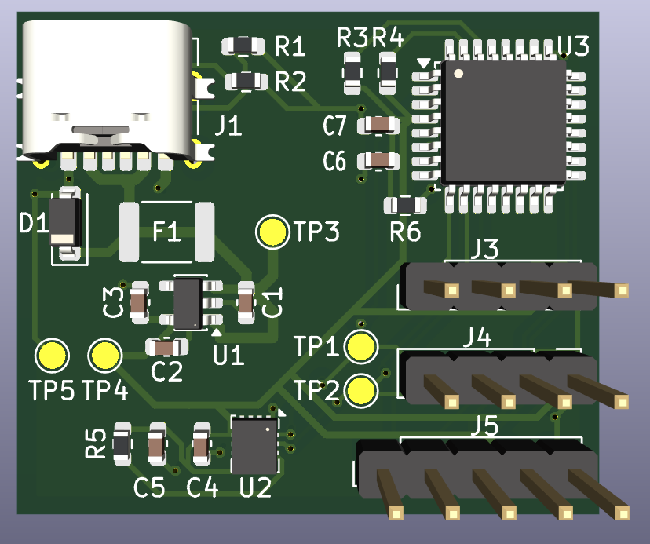
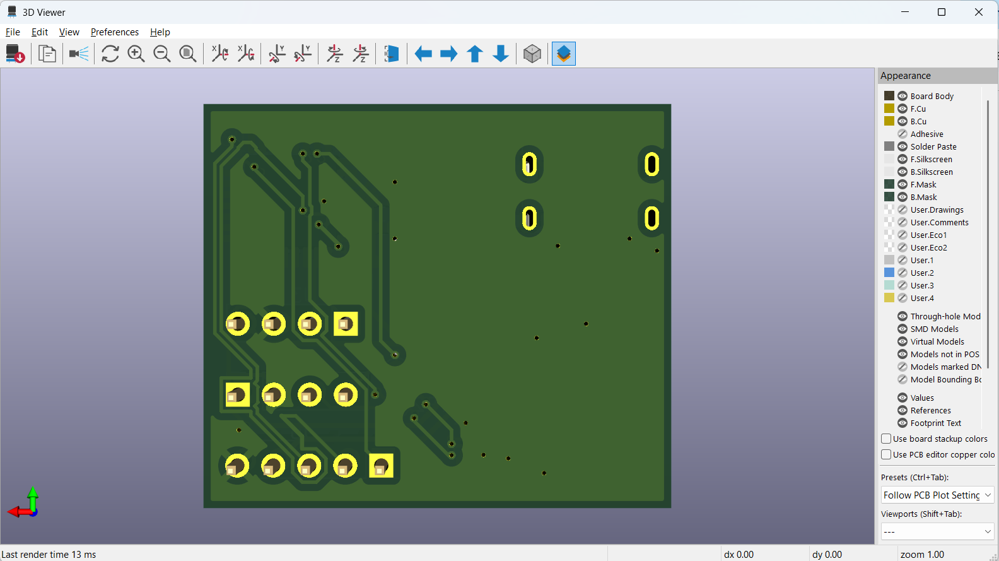
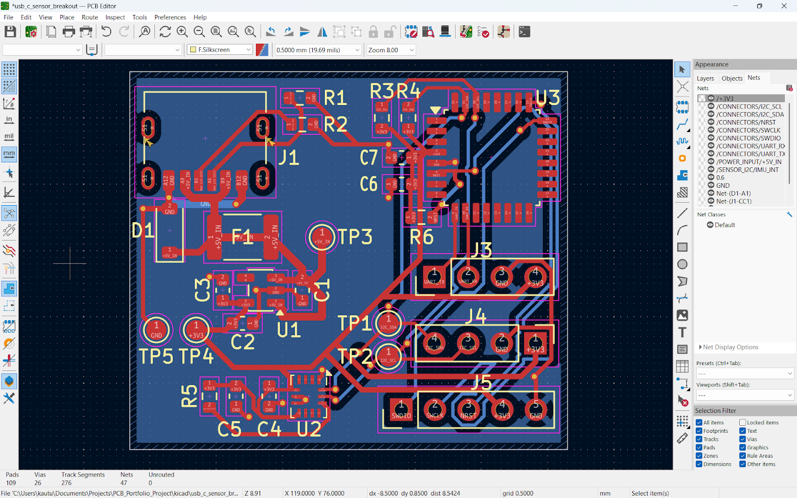
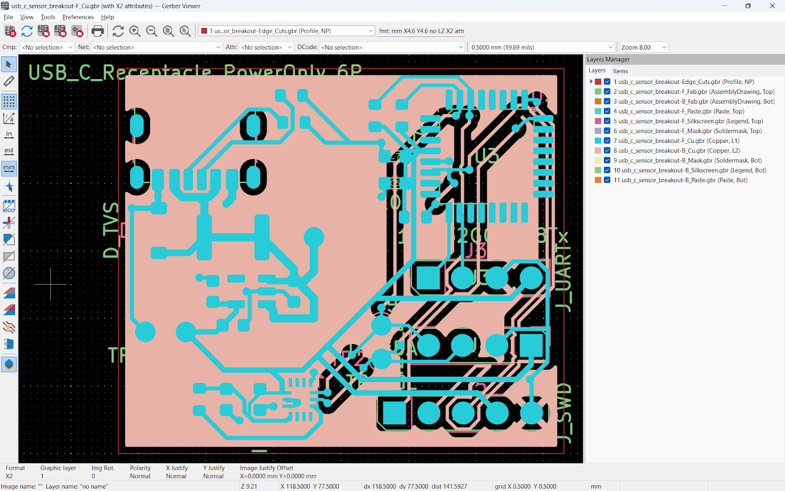
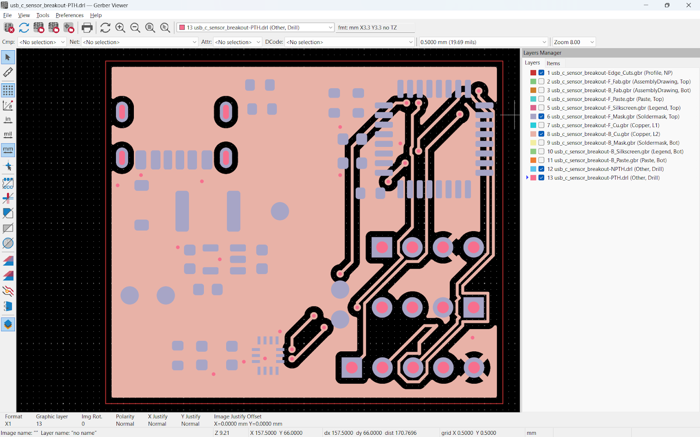

# KiCad PCB Project

A fabrication ready PCB designed as a portfolio project.  
Includes a full schematic and PCB layout, verified with ERC (Electrical Rules Check) and DRC (Design Rules Check), and validated Gerbers and drills in Gerber Viewer.



---

## Table of Contents
- [Overview](#overview)
- [Key Features](#key-features)
- [Project Status](#project-status)
- [Repo Structure](#repo-structure)
- [Verification](#verification)
- [Manufacturing Outputs](#manufacturing-outputs)
- [How to Open](#how-to-open)
- [Key Images](#images)
- [Next Improvements](#next-improvements)

---

## Overview
This project demonstrates an end to end PCB workflow:

schematic design → layout and routing → design rule checks → manufacturing outputs

The goal is to show practical board design skills (power, interfaces, layout, manufacturability) 

---

## Key Features
- USB power input with on board 3.3V regulation
- Microcontroller based system design
- I2C (Inter Integrated Circuit) sensor bus (IMU)
- Labeled connectors and test points for bring up
- Ground plane implemented
- Manufacturing package generated (Gerbers + PTH and NPTH drills)
- BOM and pick and place exported for assembly readiness

---

## Project Status
- [x] Placement and routing complete
- [x] Ground plane set
- [x] ERC clean
- [x] DRC clean
- [x] 3D view checked for footprint consistency
- [x] Gerbers generated
- [x] Drill files generated (PTH + NPTH)
- [x] Gerbers and drills verified in Gerber Viewer
- [X] BOM committed
- [X] Pick and place committed

---

## Repo Structure
```text
.
├── kicad/                     # KiCad schematic + PCB
├── manufacturing/
│   ├── gerbers/               # plotted Gerbers
│   ├── drill/                 # Excellon drills (PTH + NPTH)
│   ├── bom/                   # BOM exports
│   ├── assembly/              # pick and place / position outputs
│   └── release/               # upload ready ZIP(s)
└── images/                    
│   ├── manufacturing/         # Manufacturing related pictures
│   ├── pcb_design/            # PCB Design pictures
│   ├── schematic/             # Schematic related pictures
```
---

## Verification
- ERC (Electrical Rules Check): clean
- DRC (Design Rules Check): clean
- 3D Viewer: checked for footprint consistency
- Gerber Viewer: verified copper, mask, silkscreen, outline, and drill alignment (PTH + NPTH)

---

## Manufacturing Outputs
### Fabrication package (upload ready)
[RELEASE FILE](manufacturing/release/PCB_RELEASE_GERBER_DRILL.zip)

### Assembly data
- [BOM](manufacturing/bom/usb_c_sensor_breakout.csv)
- [Pick and Place POS Files](manufacturing/assembly)

---

## How to Open
1. Install KiCad (project created in KiCad 9.0).
2. Open the project in `kicad/`.
3. Review:
   - Schematic (`.kicad_sch`)
   - PCB layout (`.kicad_pcb`)
   - 3D Viewer
4. Manufacturing outputs are in `manufacturing/`.

---

## Images

### PCB 3D front:


### PCB 3D back:


### PCB Final Layout: 


### Gerber overlay: 


### Drill overlay (PTH + NPTH): 



---

## Next Improvements
In a future revision:
- Add fiducials
- Add additional ESD protection (eg. for external connectors)
- Improve silkscreen placement and reference readability
- Adding NPTH drills (mounting holes) for realistic usage

---

## License
All Rights Reserved.
